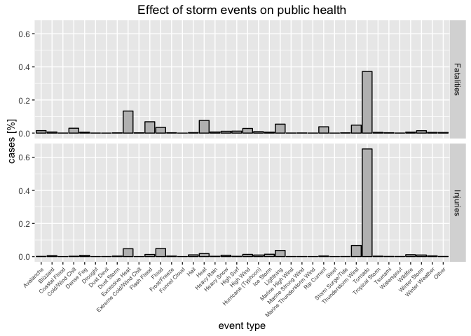
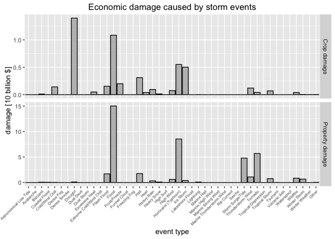

# A History of Storm Events in the US from 1950 to 2011: Effect on Population Health and Economy
Stephan Koenig  
February 14, 2016  


## Synopsis

Storm events can have a severe effect on public health and cause extensive
economic damage. This analysis looks at the National Oceanic and Atmospheric Administration's (NOAA) storm database covering events from 1950 to 2011 in the
United States and provides a summary of the impact of storm events. The biggest
dangers to public health are posed by tornados, extreme heat, and flooding.
Agriculture is most impacted by drought, flood, hurricane, ice storms, and
hail, while general property damage is mostly caused by floods, hurricanes,
tornados, and hail, as well as storm surges/tides in coastal areas. (The files
of this analysis can be found on [GitHub](https://github.com/stephan-koenig/RepData_PeerAssessment2).)

## Data processing


```r
# Load all required packages installing any that are missing.
requiredPackages <- c("dplyr", "ggplot2", "knitr", "lubridate", "tidyr")
missingPackages <- !is.element(requiredPackages, installed.packages()[,1])
missingPackages <- requiredPackages[missingPackages]
if (length(missingPackages) != 0) install.packages(missingPackages)
lapply(requiredPackages, library, character.only = TRUE)
```

The following packages are used in this analysis: **dplyr, ggplot2, knitr, lubridate, tidyr**.


```r
# Time when copy of "repdata-data-StormData.csv.bz2" in this rep was downloaded.
dateDownloaded <- "Wed Jan 27 16:16:59 2016"
filename <- "repdata-data-StormData.csv.bz2"

# Download data if not present and update time when the copy was downloaded.
if (!file.exists(filename)) {
    
    url = paste("https://d396qusza40orc.cloudfront.net/",
                "repdata%2Fdata%2FStormData.csv.bz2", sep = "")
    
    # Determine download.file method based on OS.
    if (.Platform$OS.type == "unix") {
        osMethod = "libcurl"
    } else {
        osMethod = "wininet"
    }
    
    download.file(url, filename, method = osMethod)
    dateDownloaded <- date()
    rm(url, osMethod)
}
```

File *repdata-data-StormData.csv.bz2* was downloaded on **Wed Jan 27 16:16:59 2016**.


```r
stormData <- tbl_df(read.csv("repdata-data-StormData.csv.bz2"))
```


### NAs


```r
numberNAPerColumn <- colSums(is.na(stormData))
columnsWithNA <- names(stormData)[numberNAPerColumn > 0]
```

The data contain NAs in **COUNTYENDN, F, LATITUDE, LATITUDE_E**. Since the analysis below only
considers EVTYPE, FATALITIES, INJURIES, PROPDMG, PROPDMGEXP, CROPDMG, and
CROPDMGEXP no missing values were imputed. These columns
and rows with values above 0 in either FATALITIES, INJURIES, PROPDMG,
or CROPDMG are selected for further processing.


```r
procStormData <- select(stormData, EVTYPE, FATALITIES, INJURIES, PROPDMG,
                        PROPDMGEXP, CROPDMG, CROPDMGEXP) %>%
    # Only keep rows with listed faltalities or economic damage.
    filter(FATALITIES > 0 |
           INJURIES   > 0 |
           PROPDMG    > 0 |
           CROPDMG    > 0)
```


### Processing of Exponents

The multipliers (given as either as characters or integers) in PROPDMGEXP and
CROPDMGEXP are converted into numbers for the calculation of economic
damage. Missing values and "0" for the multipliers are converted to "1".


```r
# List to change PROPDMGEXP and CROPDMGEXP replacing non-integer characters to
# integers and changed 0 to 1 (otherwise DMG listed would be multiplied with 0).
corrExp <- list("1"     = c("?", "+", "-", "", "0"),
                "2"     = c("2"),
                "3"     = c("3"),
                "4"     = c("4"),
                "5"     = c("5"),
                "6"     = c("6"),
                "7"     = c("7"),
                "8"     = c("8"),
                "9"     = c("9"),
                "1e+02" = c("h", "H"),
                "1e+03" = c("k", "K"),
                "1e+06" = c("m", "M"),
                "1e+09" = c("b", "B"))

# Assign corrected levels to PROPDMGEXP and CROPDMGEXP.
levels(procStormData$PROPDMGEXP) <- corrExp
levels(procStormData$CROPDMGEXP) <- corrExp

# Convert PROPDMGEXP and CROPDMGEXP to integers and calculate damage of each.
procStormData <- mutate(procStormData,
                       PROPDMGEXP = as.integer(as.character(PROPDMGEXP)),
                       CROPDMGEXP = as.integer(as.character(CROPDMGEXP))) %>%
    mutate(TOTAL_PROPDMG = PROPDMG * PROPDMGEXP,
           TOTAL_CROPDMG = CROPDMG * CROPDMGEXP)
```


### Consolidation of events

At this point EVTYPE still contains almost 500 different levels.
These levels are converted to one of the 48 event classes
listed in National Weather Service
[Storm Data Documentation](https://d396qusza40orc.cloudfront.net/repdata%2Fpeer2
_doc%2Fpd01016005curr.pdf) or "Other" if no match could be identified (please
see [eventNames.R](https://github.com/stephan-koenig/RepData_PeerAssessment2/blob/master/eventNames.R) for the conversion list).


```r
# Correct EVTYPE by convertig all levels to uppercase to reduce number.
procStormData <- mutate(procStormData,
                        EVTYPE = as.factor(toupper(as.character(EVTYPE))))
```


```r
# Manually assigned corrected eventNames to EVTYPE as list saved in
# eventNames.R to create variable eventNames. Code of eventNames.R is not shown
# because it is very long.
read_chunk("eventNames.R")
```


```r
levels(procStormData$EVTYPE) <- eventNames
```


## Results

### Effect of storm events on public health

The percent of cases of either fatalities or injuries caused by each storm event
class is calculated.


```r
healthEffect <- group_by(procStormData, EVTYPE) %>%
    # Calculate number of cases per event.
    summarize(Fatalities = sum(FATALITIES),
              Injuries = sum(INJURIES)) %>%
    # Calculate percent of cases per event
    mutate(Fatalities = Fatalities/sum(Fatalities),
           Injuries = Injuries/sum(Injuries)) %>%
    # remove any events with no health effects
    filter(Fatalities > 0 | Injuries > 0) %>%
    gather(type, cases, Fatalities:Injuries)

# Select top 5 storm events causing fatalities.
top5Fatalities <- filter(healthEffect, type == "Fatalities") %>%
    top_n(5, cases) %>% arrange(desc(cases))
top5Fatalities <- as.character(top5Fatalities$EVTYPE)

# Select top 5 storm events causing injuries.
top5Injuries <- filter(healthEffect, type == "Injuries") %>%
    top_n(5, cases) %>% arrange(desc(cases))
top5Injuries <- as.character(top5Injuries$EVTYPE)
```


```r
ggplot(healthEffect) +
    geom_bar(aes(x = EVTYPE, y = cases),
             stat = "identity",
             col = "black",
             fill = "grey") +
    facet_grid(type ~ .) +
    ggtitle("Effect of storm events on public health") +
    xlab("event type") +
    ylab("cases [%]") +
    theme(axis.text.x = element_text(angle = 45, hjust = 1, size = 6))
```



The top 5 storm events (from highest) causing fatalities are
**Tornado, Excessive Heat, Heat, Flash Flood, and Lightning**, and causing injuries
are **Tornado, Thunderstorm Wind, Flood, Excessive Heat, and Lightning**. The
leading cause for both fatalities and injuries are Tornados by a
large margin.


### Economic damage caused by storm events

The percent of cases of either crop or property damage caused by each storm
event class is calculated.


```r
econDmg <- group_by(procStormData, EVTYPE) %>%
    # Calculate number of cases per event.
    summarize(TOTAL_PROPDMG = sum(TOTAL_PROPDMG)/1e+10,
              TOTAL_CROPDMG = sum(TOTAL_CROPDMG)/1e+10) %>%
    # remove any events with no econmic damage
    filter(TOTAL_PROPDMG > 0 | TOTAL_CROPDMG > 0) %>%
    gather(type, amount, TOTAL_PROPDMG:TOTAL_CROPDMG) %>%
    mutate(type = ifelse(type == "TOTAL_PROPDMG",
                         "Property damage",
                         "Crop damage"))

# Select top 5 storm events causing property damage.
top5PropDmg <- filter(econDmg, type == "Property damage") %>%
    top_n(5, amount) %>% arrange(desc(amount))
top5PropDmg <- as.character(top5PropDmg$EVTYPE)

# Select top 5 storm events causing property damage.
top5CropDmg <- filter(econDmg, type == "Crop damage") %>%
    top_n(5, amount) %>% arrange(desc(amount))
top5CropDmg <- as.character(top5CropDmg$EVTYPE)
```


```r
ggplot(econDmg) +
    geom_bar(aes(x = EVTYPE, y = amount),
                   stat = "identity",
                   col = "black",
                   fill = "grey") +
    ggtitle("Economic damage caused by storm events") +
    facet_grid(type ~ ., scales = "free_y") +
    xlab("event type") +
    ylab("damage [10 billion $]") +
    theme(axis.text.x = element_text(angle = 45, hjust = 1, size = 6))
```



The top 5 storm events (from highest) causing crop damage are
**Drought, Flood, Hurricane (Typhoon), Ice Storm, and Hail**, and causing property damage
are **Flood, Hurricane (Typhoon), Tornado, Storm Surge/Tide, and Hail**.
